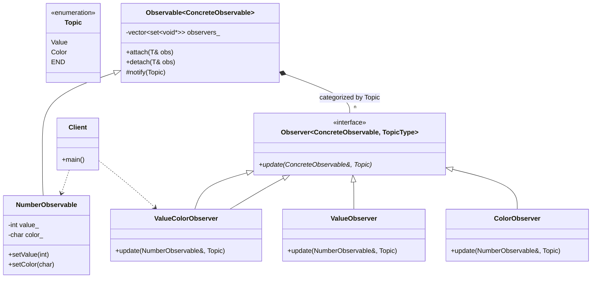

# Observer Pattern (CRTP with Topics)

### Design Note:
This implementation represents a high-performance Event Dispatcher. By using
CRTP combined with Topics, we achieve two goals:
1. Static Type Safety: The compiler ensures observers only subscribe to topics
they can actually handle.
2. Granular Notifications: The 'Observable' only notifies the specific subset of
observers interested in a particular change (e.g., notifying 'Color' subscribers
without disturbing 'Value' subscribers).
The 'ValueColorObserver' demonstrates how a single class can satisfy multiple
'Observer' interfaces to listen to different events simultaneously.
