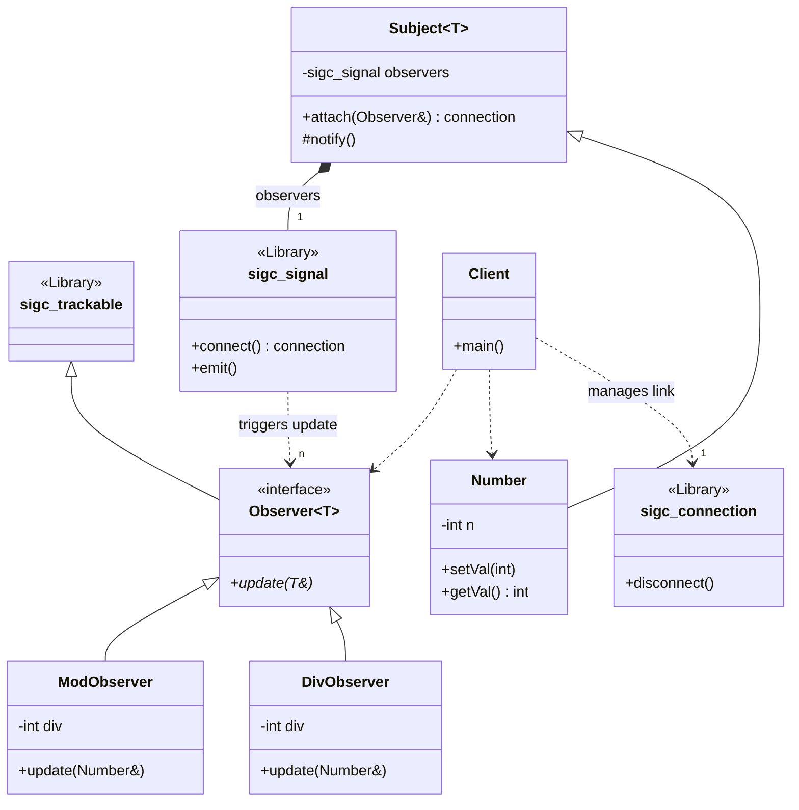

# Observer Pattern (Using libsigc++)

### Design Note:
This version leverages 'libsigc++' to implement a Signals & Slots mechanism.

1. Automatic Safety: By inheriting from 'sigc::trackable', observers are
automatically disconnected from the signal when they are destroyed, preventing
crashes.
2. Connection Management: The 'sigc::connection' object returned by 'attach'
(connect) allows the client to manually break the link at any time without
involving the subject directly.
3. Clean Handshake: The use of 'sigc::mem_fun' binds the concrete observer's
method to the signal, maintaining full type safety across the board.
