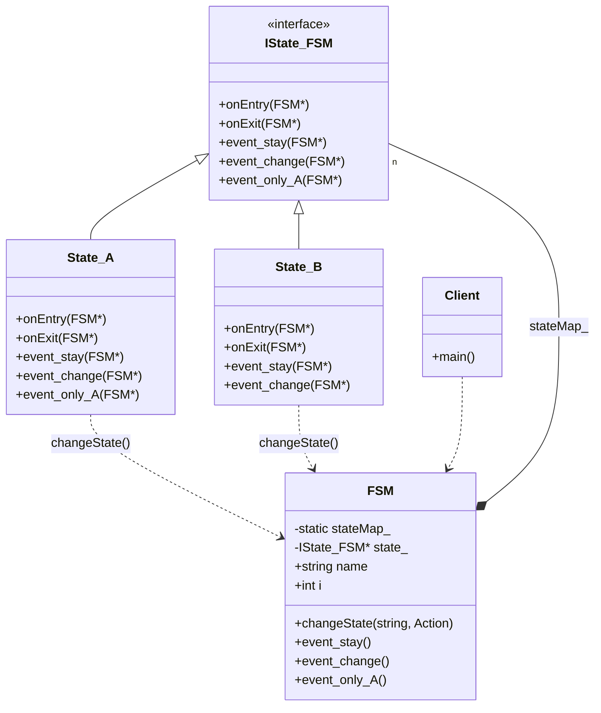

# Finite State Machine (Simple Example)

### Design Note:
This simple FSM demonstrates the basic interaction between the 'Context' (FSM)
and the 'State' objects. The FSM delegates all event handling to the 'state_'
pointer. When a transition is needed, the concrete state class calls
'changeState()' on the FSM, which handles the exit/entry logic. The states are
managed by a static map, ensuring that each state class is instantiated only
once (Singleton/Flyweight behavior).
