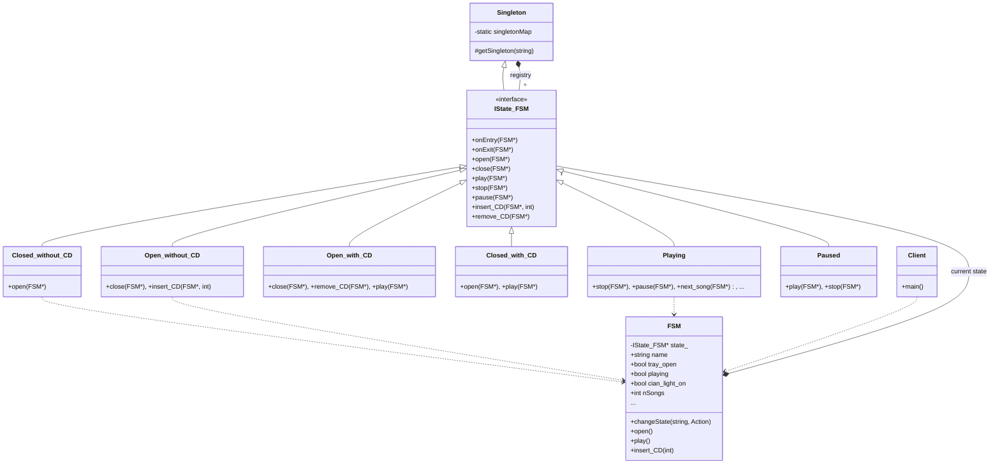

# Finite State Machine (CD Player - GoF Version)

### Design Note:
In this classic GoF implementation, the 'CD Player' (FSM) is decoupled from its
behavior. Each class represents a physical state of the hardware. The use of
'Singleton' as a base for 'IState_FSM' ensures that only one instance of each
state exists in memory (Flyweight). The FSM maintains a pointer to the current
state and delegates all external events (buttons, sensors) to it. Transitions
are performed by the states themselves calling 'changeState' back on the FSM
context.
