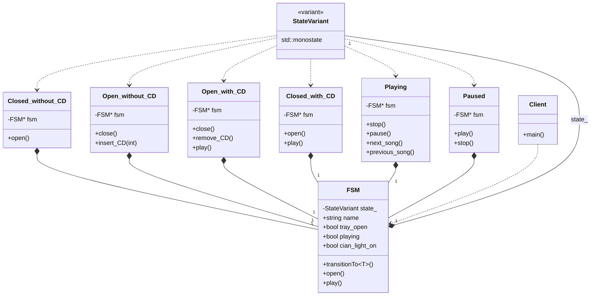

# FSM: MODERN VARIANT (C++17/23)

## Intent
Implement a Finite State Machine using `std::variant` and 
`std::visit` instead of traditional class inheritance. 
This version follows a different architectural paradigm: 
**Value Semantics**.

## The OCP (Open/Closed Principle) Dilemma
Using `std::variant` shifts the extensibility axis of 
the Open/Closed Principle:

1. **GoF Approach (Traditional Polymorphism)**:
   - **Open for New States**: Add a `FastForward` state by 
     creating a new class without touching existing code.
   - **Closed for New Events**: Adding `powerConsumption()` 
     requires updating the base interface and all states.

2. **Modern Variant Approach**:
   - **Closed for New States**: Adding a state requires 
     modifying the `StateVariant` definition (intrusive).
   - **Open for New Operations**: Add new behaviors 
     (Visitors) without touching the state structures.

## Why use std::variant? (Performance & Safety)

### 1. Value Semantics (Stack vs. Heap)
* **GoF:** Every state change usually involves dynamic 
  polymorphism (`new`/`delete`). This causes memory 
  fragmentation and heap allocation latency.
* **Variant:** The state lives on the **Stack**. Changing 
  states is as fast as a move assignment, eliminating 
  dynamic memory management.

### 2. Deterministic RAII
* **Lifecycle:** Use constructors to activate resources 
  (`onEntry`) and destructors to release them (`onExit`).
* **Safe Transitions:** Reassigning the variant ensures 
  the old state is destroyed before the new one is built, 
  preventing inconsistent intermediate states.

### 3. Static Safety (Exhaustiveness)
* **Runtime vs. Compile-time:** In GoF, forgetting a 
  method in a new state might only fail at runtime.
* **std::visit:** Forces the compiler to verify that 
  **every state** is handled. If you miss one, the 
  program **fails to compile**, ensuring 100% coverage.

## Conclusion

* **Use GoF Pattern:** For large, modular systems where 
  third-party developers add states at runtime (plugins).
* **Use Modern Variant:** For critical systems (embedded, 
  real-time) where states are well-known and you 
  prioritize memory safety and execution speed.

## Implementation Details
This example unifies logic into `States.cpp` to 
demonstrate the **high cohesion** of the Variant approach.

---
# Finite State Machine (CD Player - Variant Version)

### Design Note:
In this modern variant-based FSM, inheritance and the dynamic registry are
replaced by a type-safe union (std::variant). The FSM class owns the current
state by value on the Stack. Transitions are handled via 'std::visit' and
'transitionTo<T>', which leverages RAII: assigning a new state to the variant
automatically triggers the destructor of the previous state (onExit) and the
constructor of the new one (onEntry). This provides both memory safety and high
execution performance.
