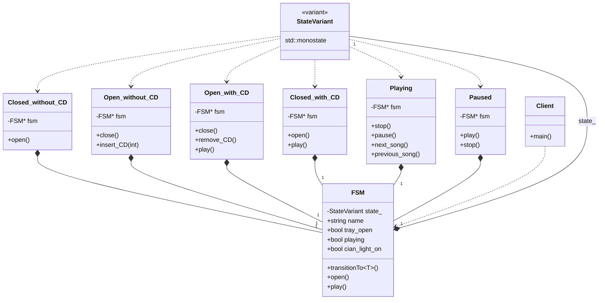

# Finite State Machine (CD Player - Variant Version)

### Design Note:
In this modern variant-based FSM, inheritance and the dynamic registry are
replaced by a type-safe union (std::variant). The FSM class owns the current
state by value on the Stack. Transitions are handled via 'std::visit' and
'transitionTo<T>', which leverages RAII: assigning a new state to the variant
automatically triggers the destructor of the previous state (onExit) and the
constructor of the new one (onEntry). This provides both memory safety and high
execution performance.
