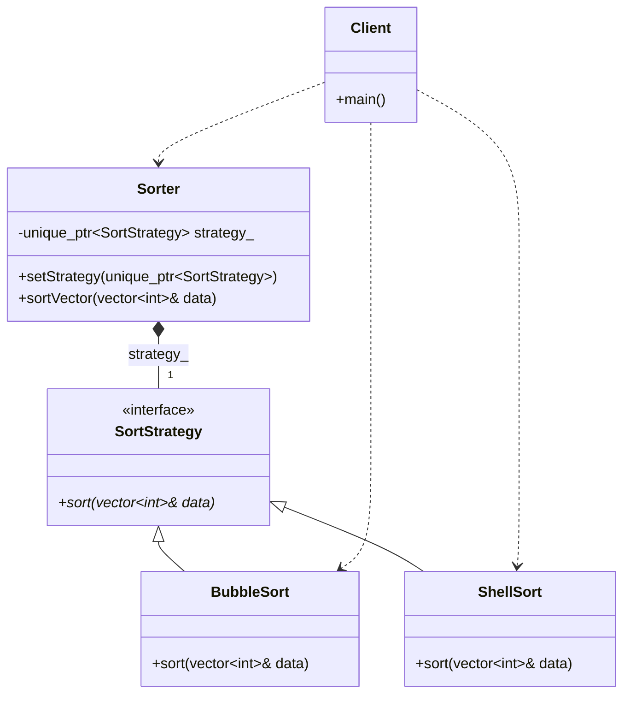

# Strategy Pattern (Simple Version)

### Design Note:
In this simple implementation, the 'Sorter' class acts as the Context. It does
not know the details of the sorting algorithms; it only maintains a reference to
the 'SortStrategy' interface. The Client is responsible for injecting the
desired concrete strategy (BubbleSort or ShellSort) into the context at
runtime. This fulfills the Open/Closed Principle, as new sorting algorithms can
be added without modifying the existing 'Sorter' code.
