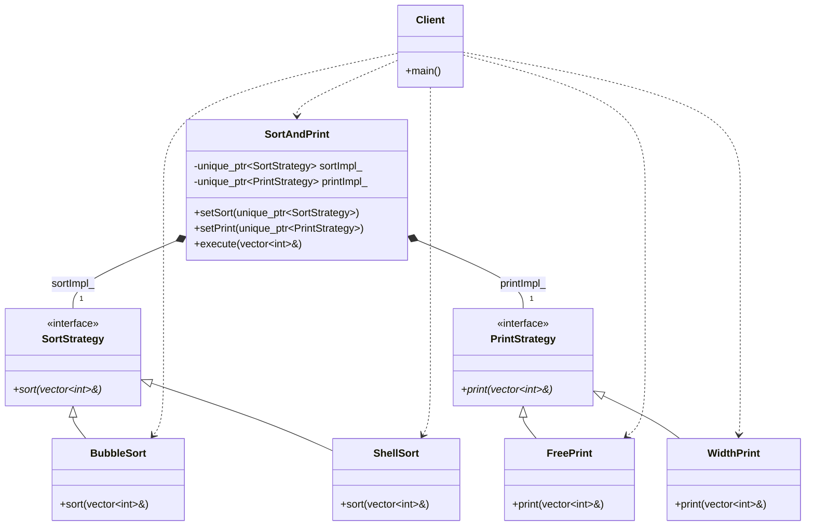

# Strategy Pattern (Advanced Composition)

### Design Note:
In this advanced version, the Context ('SortAndPrint') delegates its execution
to multiple, independent strategy families simultaneously (sorting and
printing). By using Dependency Injection, the Client configures the Context at
runtime. This prevents a combinatorial explosion of subclasses (e.g.,
BubbleSortWithFreePrint, ShellSortWithWidthPrint) and demonstrates that the
Strategy pattern scales perfectly through composition.
