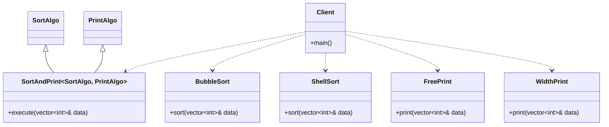

# Strategy Pattern (Static / Mixin Inheritance)

### Design Note:
In this static version, the 'SortAndPrint' class uses Mixin Inheritance. It
inherits from its template parameters ('SortAlgo' and 'PrintAlgo'). There is no
'Has_a' relationship (Composition) because there are no pointers; the object is
a single, flat structure in memory. This allows the compiler to perform
aggressive inlining, achieving Zero-Overhead polymorphism. The specific behavior
is "baked into" the type itself during compilation.
