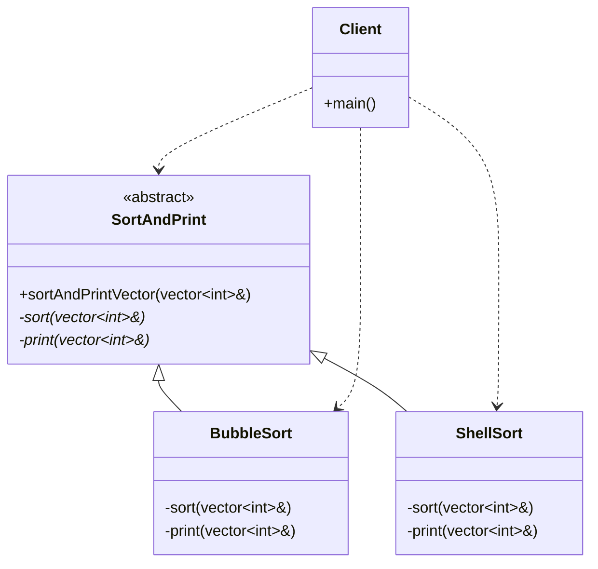

# Template Method Pattern

### Design Note:
In the Template Method pattern, the base class 'SortAndPrint' defines the
invariant part of the algorithm (the skeleton) in the public
'sortAndPrintVector' method. The variant parts (the specific sorting and
printing logic) are defined as private virtual placeholders that the base class
calls. This follows the Hollywood Principle: "Don't call us, we will call
you". Subclasses provide the implementation details, but the base class
maintains control over the execution order.
