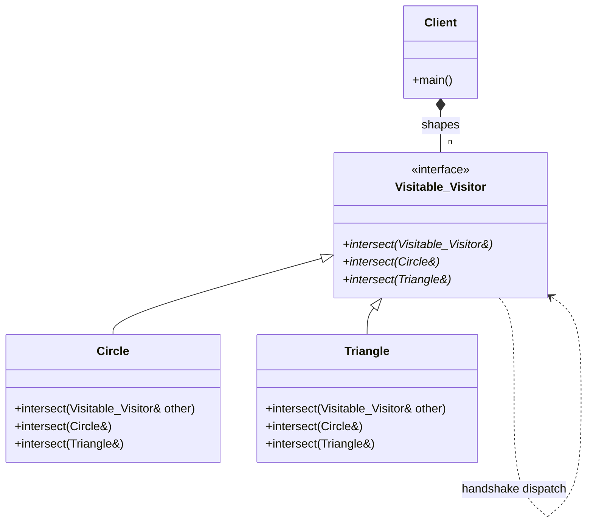

# Visitor Pattern (Simple Double Dispatch)

### Design Note:
In this "Simple" version, the 'Double Dispatch' problem is solved by making
every object both the receiver and the executor of the interaction. The
'Visitable_Visitor' interface forces every concrete shape to handle every other
shape type. When 'intersect' is called on a base pointer, the object uses its
own concrete identity (*this) to trigger the correct overload in the second
object, resolving the types of both participants at runtime.
