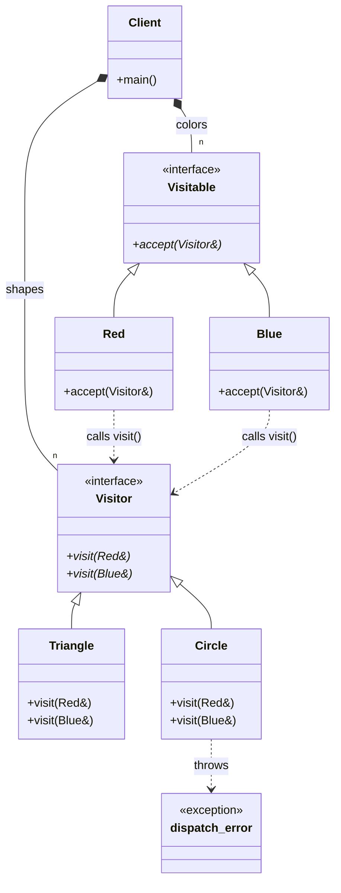

# Visitor Pattern (GoF Double Dispatch)

### Design Note:
In this classic GoF implementation, we decouple the hierarchy of elements
(Colors) from the hierarchy of operations (Shapes). The 'Visitable' interface
defines the 'accept' method, which acts as the entry point for the
handshake. The 'Visitor' interface must declare a 'visit' method for every
concrete type in the Visitable hierarchy. This creates a cyclic dependency but
provides a type-safe way to resolve both the element and the operation types at
runtime without manual type checking.
