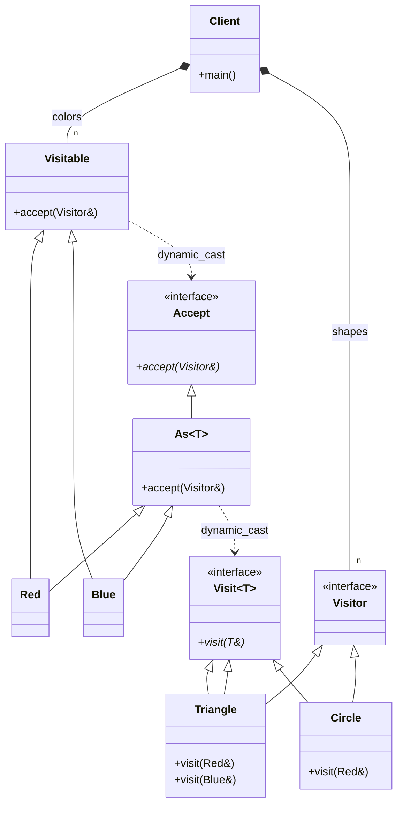

# VISITOR PATTERN ACYCLIC VARIATION (RTTI)

Run-Time Type Information (RTTI) is a C++ mechanism that allows a program to
determine the type of an object during program execution. It is particularly
useful in object-oriented programming when dealing with polymorphic classes,
where the actual (dynamic) type of an object may be different from its
declared (static) type (e.g., a base class pointer pointing to a derived
class object).

## Intent
This implementation demonstrates the "Acyclic Visitor" pattern. Its primary 
goal is to break the cyclic dependency inherent in the classic GoF Visitor, 
allowing you to add new Visitable classes without having to recompile the 
entire Visitor hierarchy.

## The Problem with GoF Visitor
In the classic version, the base 'Visitor' class must declare a 'visit' 
method for every 'Visitable' class. This creates a "Cycle":
- Visitor depends on all Visitable elements.
- Visitable elements depend on the Visitor interface.
If you add a single new Color or Shape, every Visitor in your system 
must be modified and recompiled.

## The RTTI Solution
By using Run-Time Type Information (RTTI), we can decouple these 
hierarchies. The base Visitor is now an empty interface. We use specific 
template interfaces (Visit<T>) for each operation and 'dynamic_cast' 
to verify at runtime if a visitor can handle a specific element.

## Key C++ RTTI Elements used in this example:

1. dynamic_cast: 
This operator performs a safe downcast or cross-cast within the 
inheritance hierarchy at runtime. In this pattern:
- It is used to check if the 'Visitor' can be cast to 'Visit<SpecificType>'.
- If the cast is valid, the operation is performed.
- If not, it returns nullptr (or throws std::bad_cast for references), 
allowing us to handle the failure gracefully.

2. typeid: 
This operator returns a reference to a 'std::type_info' object. 
In this implementation:
- It is used within our 'dispatch_error' exception to identify the 
exact types that caused the dispatch failure.
- It provides the human-readable (or mangled) name of the classes 
involved in the interaction.

## Structure of this Implementation
- Visitor: A base interface with no dependencies.
- Visit<T>: A template interface for a visitor that knows how to visit T.
- As<T>: A helper used by Visitable classes to orchestrate the dynamic 
cast back to the specific visitor logic.
- Visitable: The base for elements that accept visitors via RTTI dispatch.

## Benefits
- True Decoupling: Adding new visitable elements does not require 
recompiling existing visitors.
- Extensibility: Visitors only implement the methods they actually need.

---
# Visitor Pattern (Acyclic RTTI Version)

### Design Note:
This diagram illustrates the 'Acyclic Visitor' variation. By using RTTI
(dynamic_cast), we decouple the Visitor interface from the concrete
elements. The base 'Visitor' is now empty, and concrete visitors only inherit
from the 'Visit<T>' interfaces they actually need to implement. This allows
adding new 'Visitable' classes without recompiling the entire visitor hierarchy,
solving the main drawback of the classic GoF pattern.
