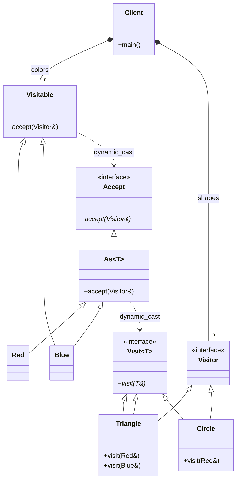

# Visitor Pattern (Acyclic RTTI Version)

### Design Note:
This diagram illustrates the 'Acyclic Visitor' variation. By using RTTI
(dynamic_cast), we decouple the Visitor interface from the concrete
elements. The base 'Visitor' is now empty, and concrete visitors only inherit
from the 'Visit<T>' interfaces they actually need to implement. This allows
adding new 'Visitable' classes without recompiling the entire visitor hierarchy,
solving the main drawback of the classic GoF pattern.
