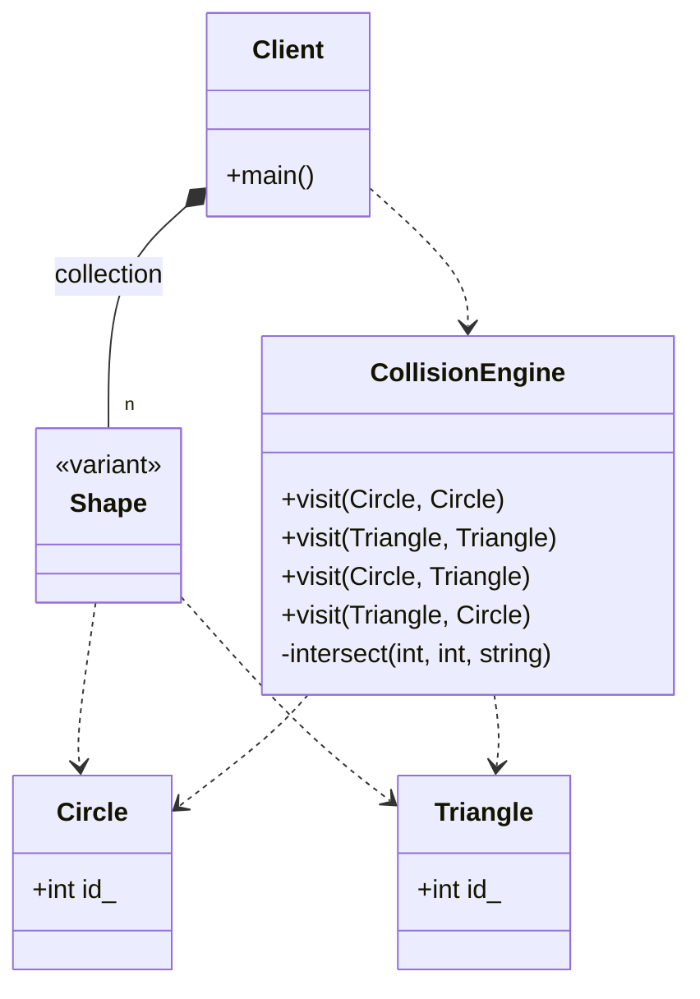

# Visitor Pattern (Modern Variant Version)

### Design Note:
In this modern C++17 implementation, the Visitor pattern achieves Double
Dispatch through 'std::variant' and 'std::visit'. This approach is
non-intrusive, as 'Circle' and 'Triangle' are plain data structures. The
'CollisionEngine' acts as the visitor, centralizing all interaction logic. By
using 'std::visit' with multiple arguments, the system automatically handles the
dispatch matrix. This version includes an optimization for symmetry
(Circle-Triangle being handled the same as Triangle-Circle) and stores objects
by value in the collection for better performance.
