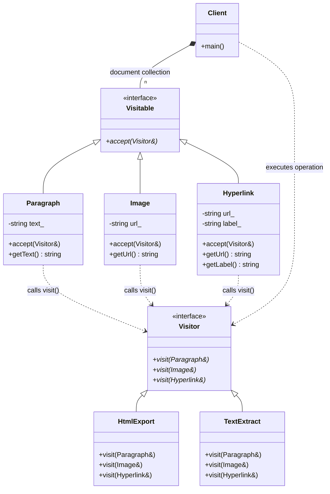

# VISITOR PATTERN TRADITIONAL GOF

## Intent
This implementation follows the classic Gang of Four (GoF) approach to the 
Visitor pattern. It decouples the object structure (Visitable elements) from 
the operations performed on them (Visitor operations).

## How it works
- Visitable Interface: Defines an 'accept' method that takes a Visitor.
- Concrete Visitables: Each element class implements 'accept' by calling 
'visitor.visit(*this)'. This is the "handshake" that identifies the 
concrete type of the element.
- Visitor Interface: Declares 'visit' methods for every concrete Visitable 
type, allowing the Visitor to perform specific operations based on the 
element type.

## The OCP (Open/Closed Principle) Trade-off:
This pattern illustrates a classic architectural trade-off:

1. Open for Extension (Operations):
You can add new operations (e.g., JsonExport) without modifying any 
existing Visitable classes. You simply create a new Visitor class. 

2. Closed to Modification (Hierarchy):
It is NOT open to adding new Visitable elements easily. If you add a 
'VideoElement', you MUST update the base 'Visitor' interface, which 
forces the recompilation of all existing Visitor classes.

## Why is this acceptable?
In many real-world scenarios, the object hierarchy is stable (e.g., 
elements in a document), while the operations are volatile (exporting, 
indexing, rendering). In these cases, the stability of the hierarchy 
outweighs the cost of occasionally updating the visitors.

## Implementation Note
This version uses the "Double Dispatch" technique via overloading (the 
'accept' call provides the runtime type, and the 'visit' call uses static 
overloading resolution), providing full type safety without manual 
casts or RTTI.

---
# Visitor Pattern (Traditional GoF - Extending Behaviors)

### Design Note:
In this "Extending Behaviors" scenario, the object structure (Paragraph, Image,
Hyperlink) is considered stable. The power of the GoF Visitor lies in its
ability to add completely new operations, like 'HtmlExport' or 'TextExtract',
without changing the code of the data elements. The 'accept' method provides the
entry point for the visitor to perform its specific logic on each concrete type.
