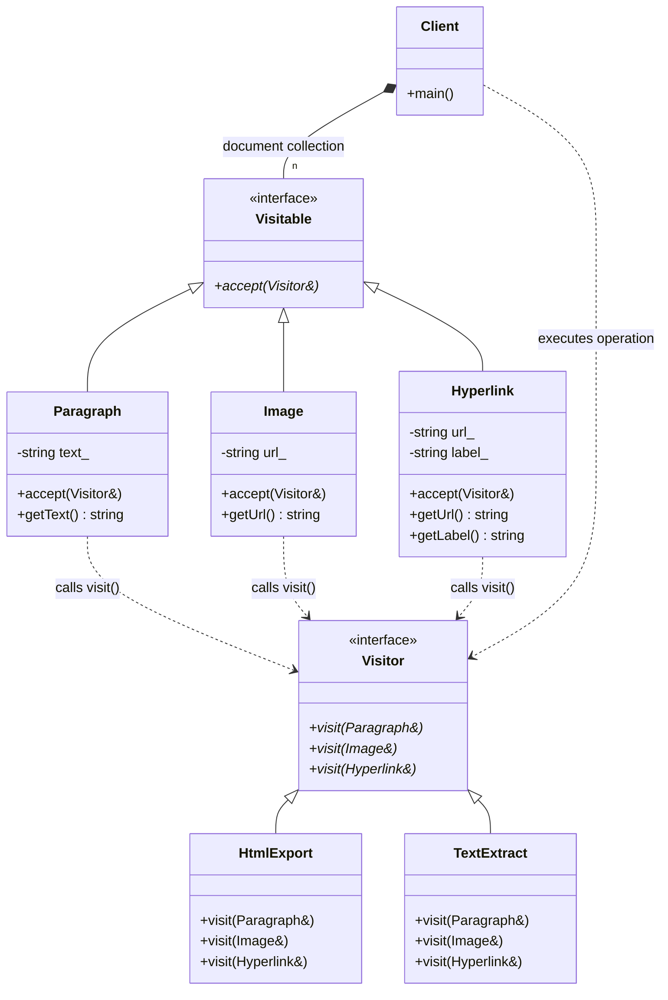

# Visitor Pattern (Traditional GoF - Extending Behaviors)

### Design Note:
In this "Extending Behaviors" scenario, the object structure (Paragraph, Image,
Hyperlink) is considered stable. The power of the GoF Visitor lies in its
ability to add completely new operations, like 'HtmlExport' or 'TextExtract',
without changing the code of the data elements. The 'accept' method provides the
entry point for the visitor to perform its specific logic on each concrete type.
