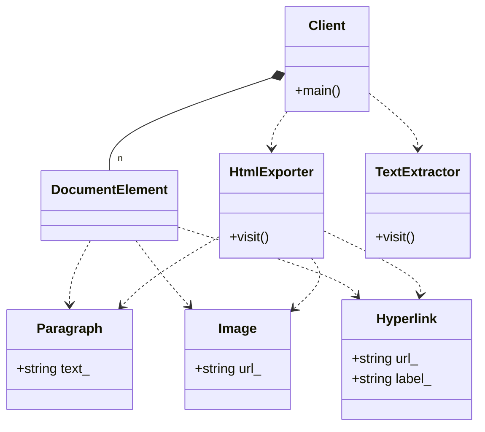

# Visitor Pattern (Modern Variant - Extending Behaviors)

### Design Note:
In this modern C++ version, the Visitor pattern is completely non-intrusive. The
element classes (Paragraph, Image, Hyperlink) are treated as pure data and do
not need a base class. The 'DocumentElement' is a type-safe union
(std::variant). New operations like 'HtmlExporter' or 'TextExtractor' are
separate objects. The 'Client' processes the entire collection using
'std::visit', providing compile-time safety and high performance by avoiding
virtual function overhead.
