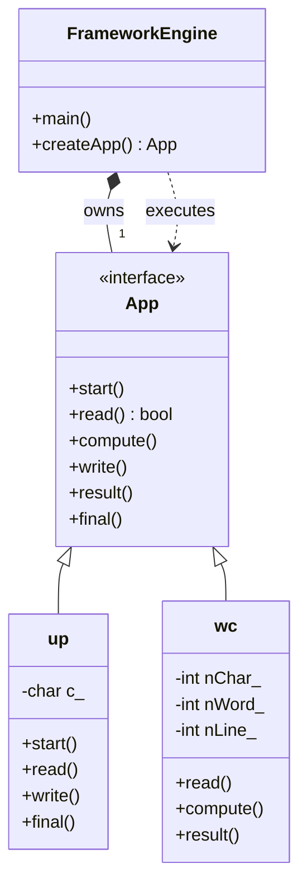

# Framework Design Pattern

### Design Note:
This diagram illustrates the "Hollywood Principle" (Inversion of Control). The
'FrameworkEngine' (representing 'libFramework.so') owns the main execution
loop. It is responsible for creating exactly one instance of an 'App' and
calling its methods in the predefined sequence. Concrete applications like 'up'
and 'wc' simply plug into this skeleton by inheriting from 'App', providing
their specific logic without ever controlling the main loop themselves.
