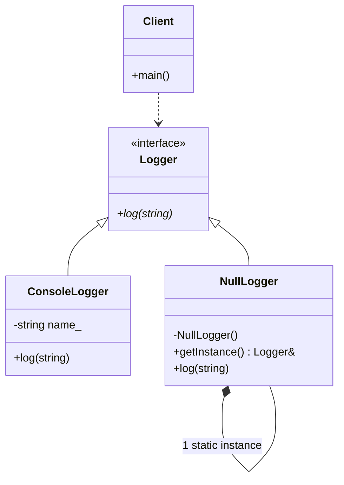

# Null Object Pattern (Classic GoF)

### Design Note:
In this classic implementation, 'NullLogger' is a concrete class that inherits
from the 'Logger' interface but provides a "no-op" (do nothing) implementation
of the 'log' method. By providing a valid object instead of a null pointer, the
'Client' can iterate through a collection of loggers and call 'log()' without
using 'if (logger != nullptr)' checks, leading to cleaner and safer code.
