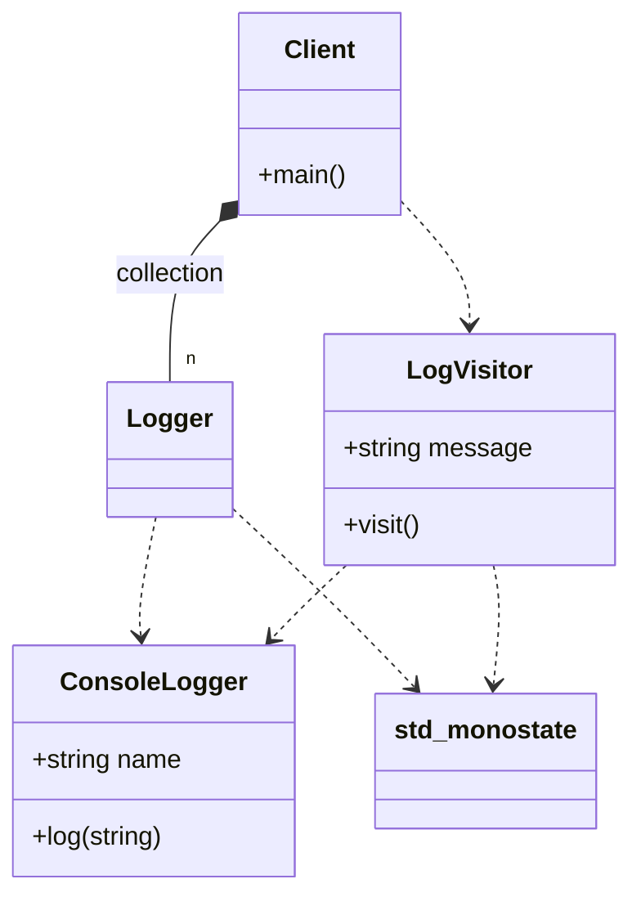

# Null Object Pattern (Modern Variant)

### Design Note:
In this modern C++ version, the Null Object pattern is implemented using
'std::variant' and 'std::monostate'. There is no need for a base interface or
virtual functions. 'std::monostate' acts as the explicit type for the Null
Object. The 'LogVisitor' encapsulates the logic: it performs the logging for
'ConsoleLogger' and does nothing for 'std::monostate'. This ensures "Value
Semantics" (objects are stored on the stack/vector directly) and "Static
Safety", as the compiler verifies that both the real and the null cases are
handled.
