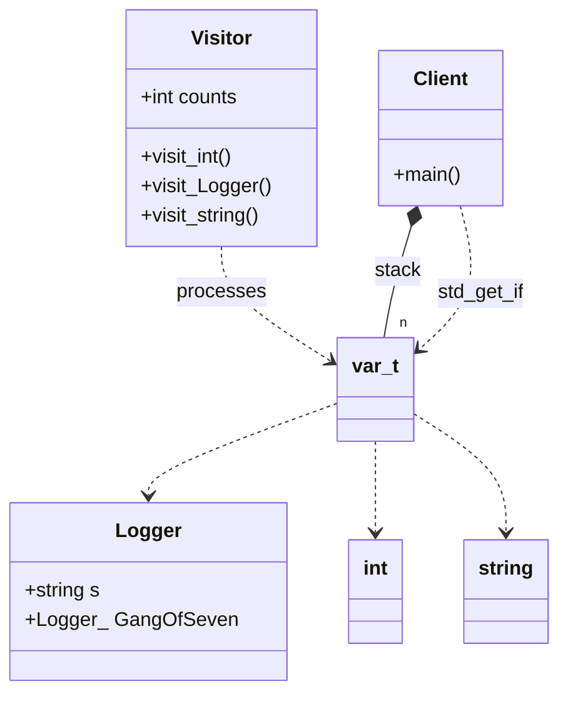

# std::variant (Modern C++17 Feature)

### Design Note:
This diagram represents a non-polymorphic heterogeneous collection. The 'var_t'
(std::variant) acts as a type-safe union that can hold any of the specified
types. The 'Visitor' is a stateful functor that performs operations on the
variant's current content via 'std::visit'. Unlike traditional OO designs, there
is no base class; memory is managed automatically on the stack or within the
container, following Value Semantics. The 'Logger' class is used here to prove
that constructors and destructors are called correctly during these value-based
transitions.
