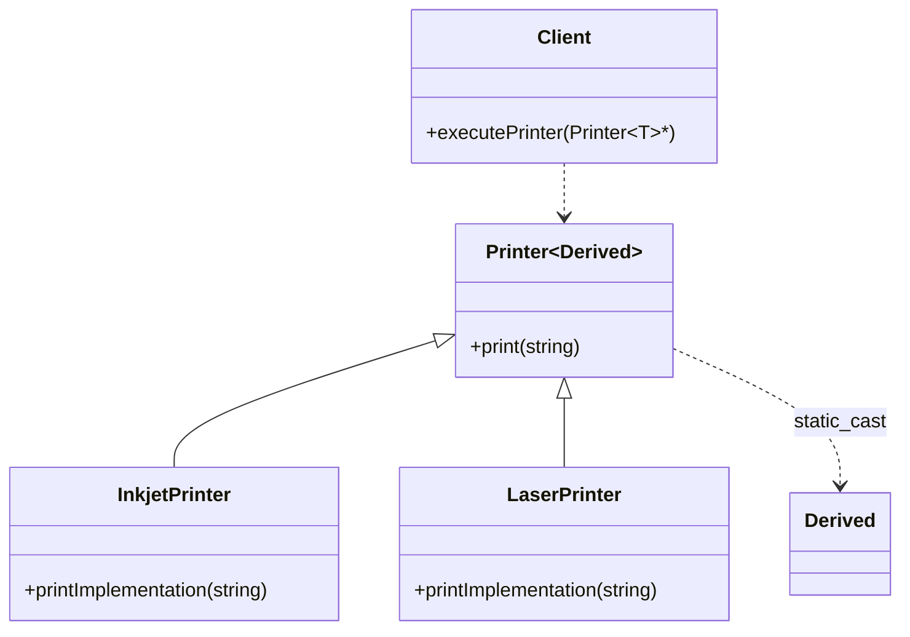

# CRTP: Static Polymorphism

### Design Note:
This diagram illustrates the Curiously Recurring Template Pattern (CRTP). Unlike
dynamic polymorphism, 'Printer' is not a single base class, but a template. When
'InkjetPrinter' inherits from 'Printer~InkjetPrinter~', the base class gains
knowledge of the derived type at compile-time. The 'print()' method in the base
class performs a 'static_cast' to call 'printImplementation()' in the derived
class, achieving polymorphic behavior with zero runtime overhead and no virtual
table.
