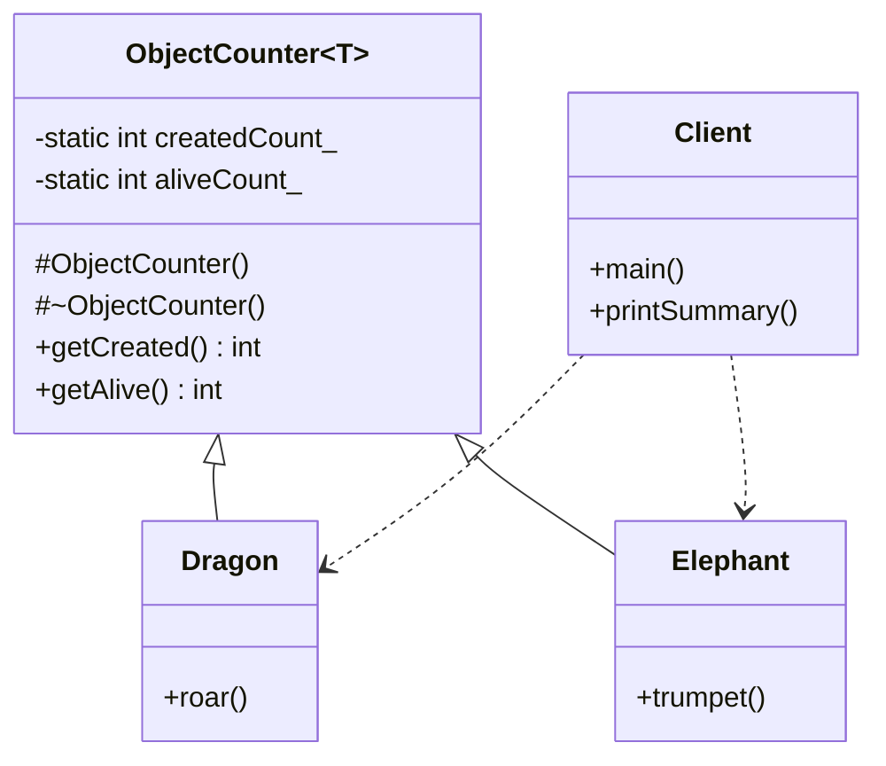

# CRTP: Object Counter

### Design Note:
This diagram shows the "Object Counter" idiom. By using CRTP, the
'ObjectCounter' base class is instantiated separately for 'Dragon' and
'Elephant'. This means the static members 'createdCount_' and 'aliveCount_' are
not shared between different species; each derived class gets its own unique set
of counters automatically. The protected constructor and destructor in the base
class ensure that the counting logic is triggered every time a derived object is
born or dies.
