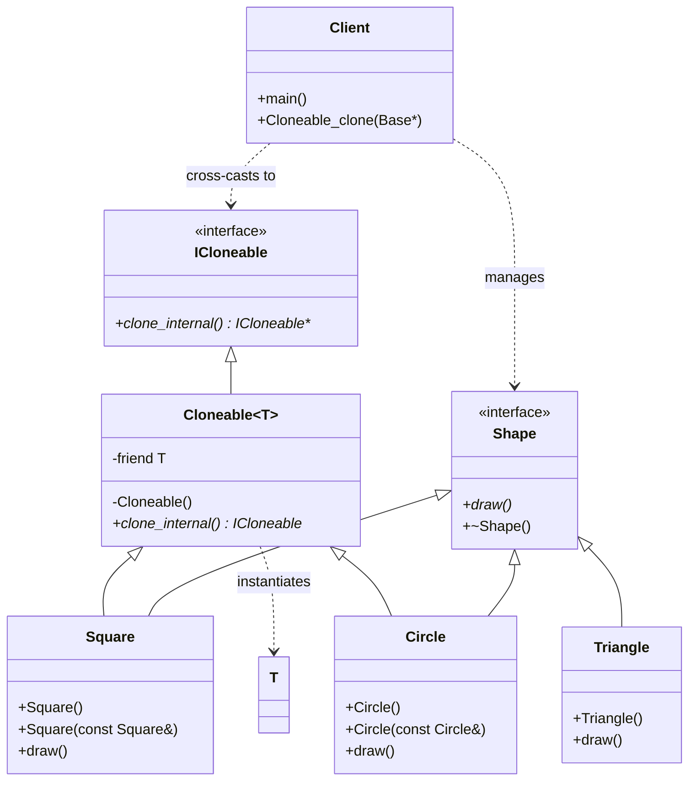

# CRTP: Polymorphic Clone (Smart Mixin)

### Design Note:
This diagram illustrates the "Non-Intrusive Prototype" architecture. The 'Shape'
interface remains pure, containing only business logic. Cloning is injected
"from the side" using Multiple Inheritance.
1. Automation: The 'Cloneable' Mixin uses CRTP to implement the copy logic once
for all classes.
2. Safety: The private constructor and 'friend T' in the Mixin ensure only the
correct class can inherit from its specialized template.
3. Decoupling: The 'Client' uses the 'Cloneable_clone' utility to perform a
runtime "Cross-Cast" (dynamic_cast) from the 'Shape' branch to the 'ICloneable'
branch. If an object (like Triangle) does not inherit from the Mixin, the system
detects it and throws an exception, preserving architectural integrity.
