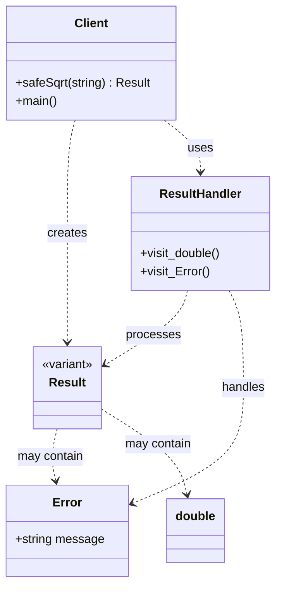

# Error Handling (std::variant Version)

### Design Note:
This diagram illustrates the "Errors as Values" paradigm. The 'Result' type is a
type-safe union (std::variant) that forces the developer to acknowledge the
possibility of failure. The 'ResultHandler' visitor encapsulates the logic for
both successful and failed outcomes. This design eliminates the need for output
parameters or side-effect-heavy exceptions, making the function 'safeSqrt'
honest about its potential results.
