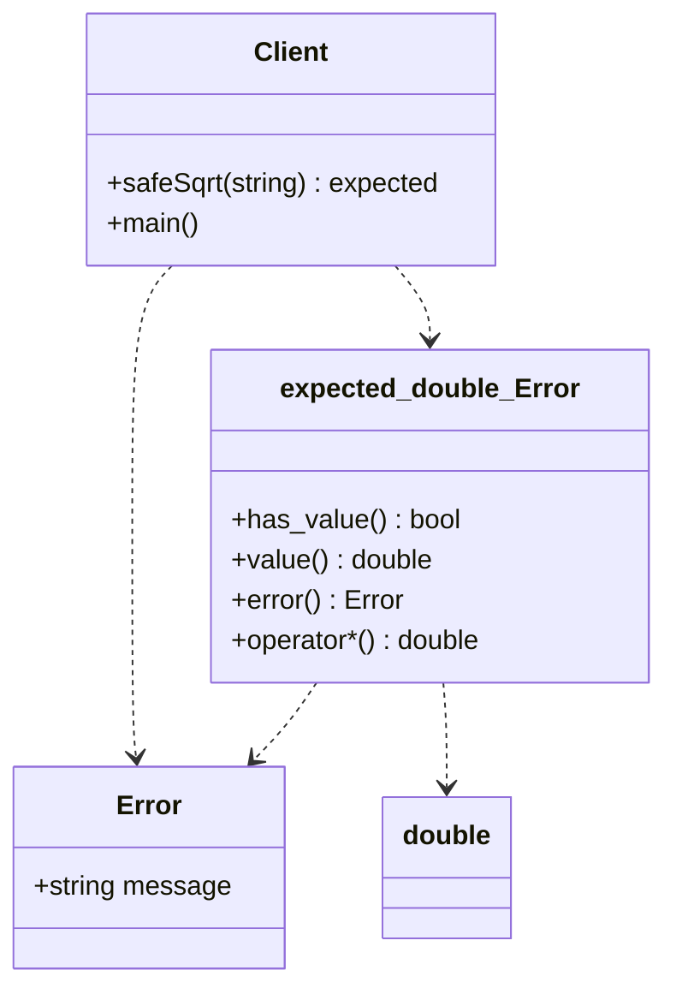

# Error Handling (std::expected Version)

### Design Note:
This is the state-of-the-art C++23 approach for error handling. The
'std::expected' template acts as a vocabulary type that clearly communicates
that a function might fail. Unlike 'std::variant', it provides a pointer-like
interface (operator* and bool conversion) which is more intuitive for C++
developers. This implementation represents the final evolution in the
repository, moving from manual error management to a standardized,
high-performance, and type-safe functional approach.
